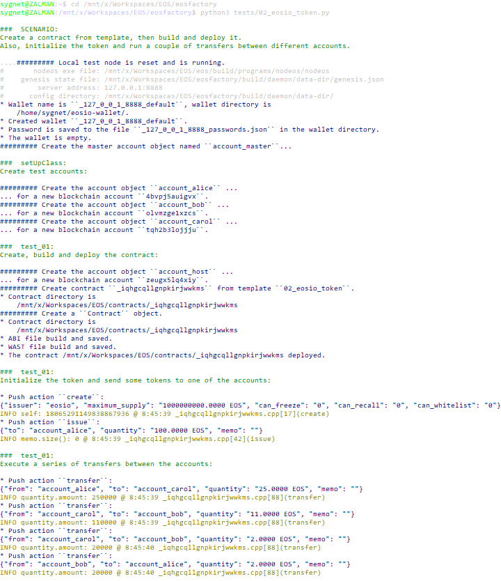
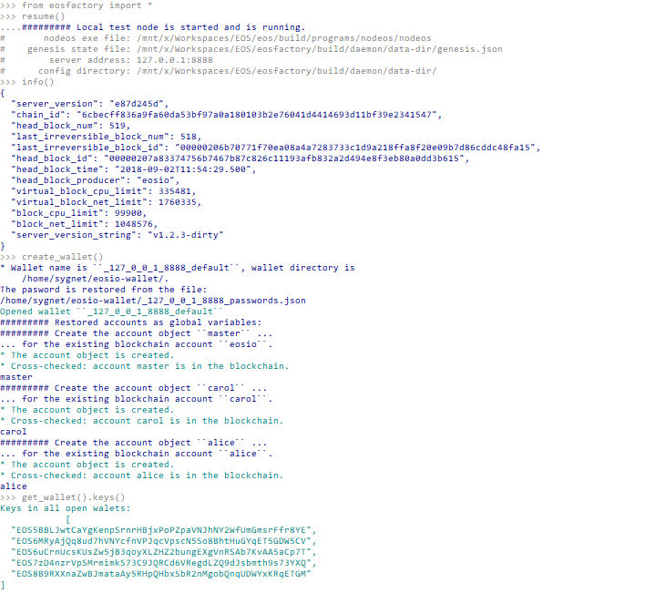

# Wallet Object

This file can be executed as a python script:
```
cd docs/sphinx/source/cases
python3 03_wallet/case.py
```

## Set-up

The set-up statements are explained at [cases/01_setup](../cases/01_setup/case.html).

```
from eosfactory import *
```

## Case

The `Wallet` class wraps EOSIO wallets. The `Wallet` object keeps track of account objects, as described in [cases/00_account](../cases/00_account/case.html).

There has to be exactly one `Wallet` object in the namespace. After the `Wallet` singleton is created, it remains transparent to the script, yet usually, there is no need to access it directly.

Although *EOSFactory* manages only one `Wallet` object at a time, it produces numerous wallet files in the wallet directory, i.e. in the location where the `keosd` wallet manager stores its wallets. The wallet files are marked with prefixes, which are either encoding the URL of the active testnet (i.e. the one which was active during the creation time) or arbitrary  (i.e. defined *ad hoc* by a specific unit test script).

There is an important distinction regarding prefixes:

* Testnet prefixes are consequently used in context of their nodes. They keep *EOSFactory* state between sessions.
* Arbitrary prefixes mark wallets associated with specific unit tests. They are erased before repeating their tests.
* Empty prefix (not implemented yet) are reserved for wallets to be used with the mainnet.

#### Create a new wallet

Let's create a wallet and a couple of accounts with a local testnet:

```
from eosfactory import *
reset()
info()
create_wallet()
create_master_account("master")
create_account("alice", master)
create_account("carol", master)
get_wallet().keys()
stop()
```

Here is the expected outcome:



What has happened?

* The local testnet is reset. Prior to the reset, the specifically marked wallet is deleted, together with other files having the same prefix, i.e. the password storage file and the account mapping file.
* The wallet object is created.
* Its password is stored to a file.
* An account object named `master` is created and its keys are stored in the wallet.
* The local testnet is stopped.

#### Resume the testnet

If we exit the Python session, then create a new session, and resume the testnet, *EOSFactory* will recreate the wallet, including the private keys we created in the previous session:

```
from eosfactory import *
resume()
info()
create_wallet()
get_wallet().keys()
stop()
```

Here is the expected outcome:



Access an existing wallet

```
from eosfactory import *
reset()
info()
create_wallet()
get_wallet().keys()
stop()
```


### Methods of the `Wallet` class

We plan the Factory so that the singular wallet object is never referred to, in usual scripts. However, the `Wallet` class has several methods that are used internally. Some of them are obvious:

* Open wallet.
* Unlock wallet.
* Keys in all open wallets.
* etc.
