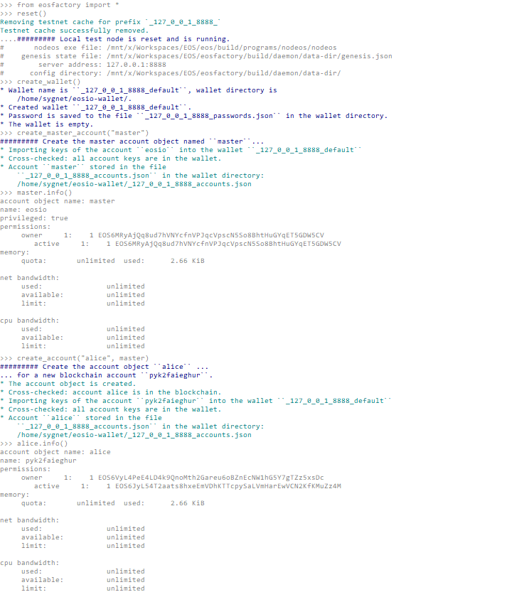
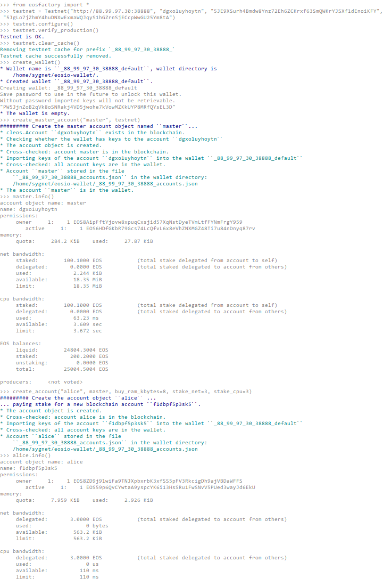
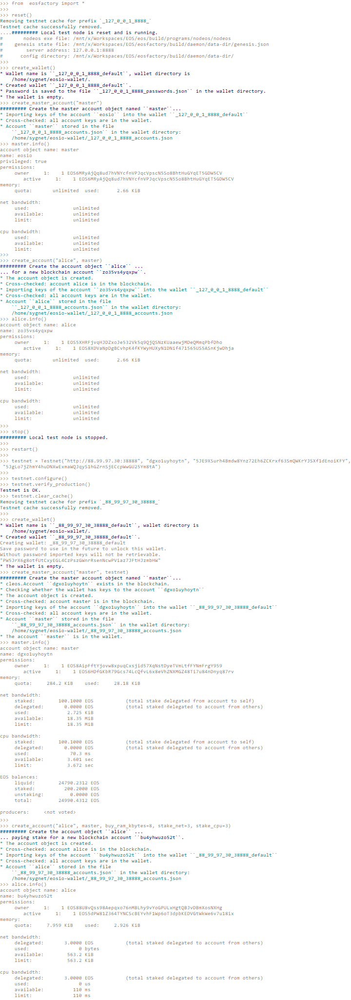

# The Master Account

This case demonstrates how the concept of master account is applied in *EOSFactory*. 

## Context

*EOSFactory* wraps *EOSIO* accounts using Python objects, i.e. instances of the `Account` class. A master account is also an instance of the `Account` class, but it plays a special role in *EOSFactory*: it spawns other accounts into existence.

The implementation of a master account is dependent on the context:

* On a local (private) testnet the master account refers to the `eosio` super account. As such, it has limited capabilities, e.g. it cannot be associated with a smart-contract.
* Whereas on a remote (public) testnet the master account refers to the initial account created by the user manually. It behaves like a normal account, apart from the fact that it is used to sponsor the creation of other accounts.

## Case

We consider two scenarios: first a local (private) testnet, and then a more complex situation of a remote (public) testnet.

#### Local testnet

Create a new Python session and import *EOSFactory* API:

```
$ python3
```

```
from eosfactory import *
```

First, let's start a local testnet:

```
reset()
```

Next, we create a wallet and then we use the `create_master_account` command to create a global variable named `master` referencing the `eosio` account.

```
create_wallet()
create_master_account("master")
master.info()
```

And finally, we show how the `master` variable can be used to create other accounts:

```
create_account("alice", master)
alice.info()
```

Here is the expected outcome:



Finally, stop the local testnet and exit Python CLI:

```
stop()
exit()
```

#### Remote testnet

Create a new Python session and import *EOSFactory* API:

```
$ python3
```

```
from eosfactory import *
```

First, we need to define a remote testnet and pass to *EOSFactory* the data of the account we control there:

```
testnet = Testnet("http://88.99.97.30:38888", "dgxo1uyhoytn", "5JE9XSurh4Bmdw8Ynz72Eh6ZCKrxf63SmQWKrYJSXf1dEnoiKFY", "5JgLo7jZhmY4huDNXwExmaWQJqyS1hGZrnSjECcpWwGU25Ym8tA")
```

We supply four parameters:

- an URL of a public node offering access to the testnet, e.g. `http://88.99.97.30:38888`,
- the name of an existing account on this testnet, e.g. `dgxo1uyhoytn`,
- the account's owner & active private keys.

Next, we let *EOSFactory* configure and verify the testnet:

```
testnet.configure()
testnet.verify_production()
testnet.clear_cache()
```

Then, we precede to create a global variable named `master` referencing the remote testnet account:

```
create_wallet()
create_master_account("master", testnet)
master.info()
```

**NOTE:** In this case the `create_master_account` command takes an extra parameter, i.e. the reference to the remote testnet.

And finally, we show how the `master` variable can be used to create other accounts:

```
create_account("alice", master, buy_ram_kbytes=8, stake_net=3, stake_cpu=3)
alice.info()
```

**NOTE:** You might want to tweak with the extra parameters, i.e. `buy_ram_kbytes`, `stake_net` and `stake_cpu`.

Here is the expected outcome:



Exit Python CLI:

```
exit()
```

## Test run

The examples presented in this document can be executed as a Python script:

```
python3 docs/sphinx/source/cases/05_master_account/case.py
```

You should get output similar to this:



