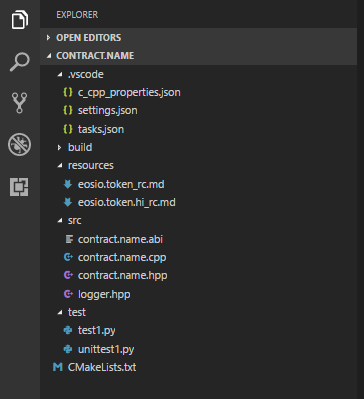
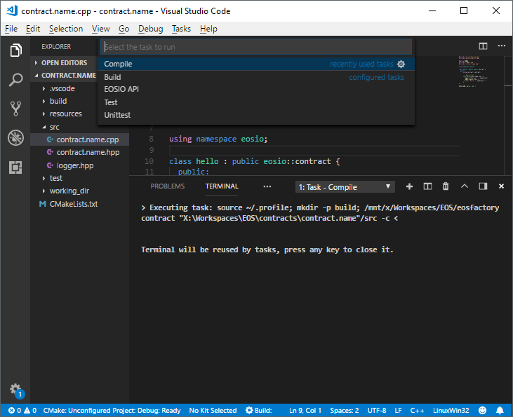
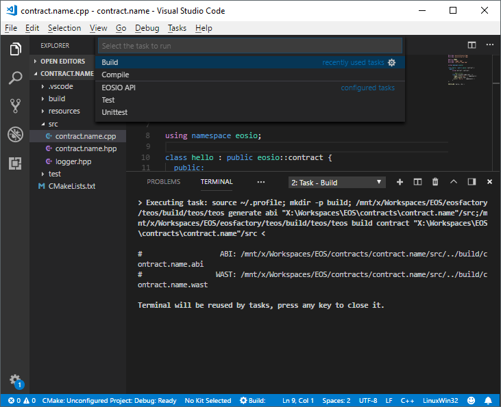
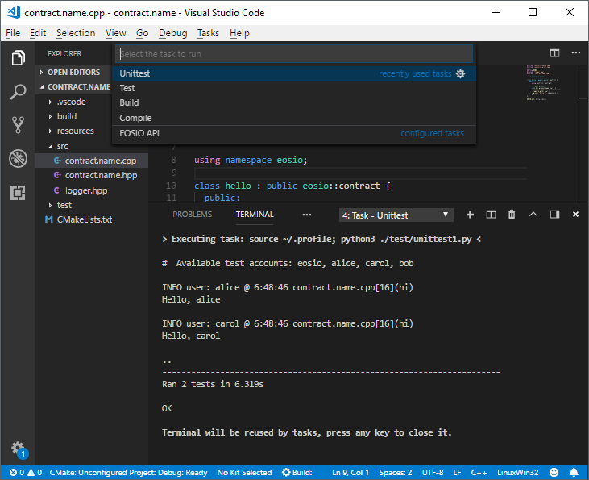
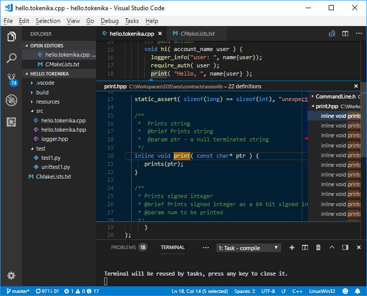

# Working with EOS Contracts using EOSFactory in *Visual Studio Code*

The purpose of this tutorial is to demonstrate how EOSFactory can be combined with [Visual Studio Code](https://code.visualstudio.com/) in order to streamline the process of working with EOS smart-contracts.

## Prerequisites

- This tutorial assumes that you have successfully installed EOSFactory. If it's not the case, please refer to [Installing EOSFactory](https://mail.google.com/mail/u/0/01.InstallingEOSFactory.html).

- We assume that you are familiar with the material covered in [Interacting with EOS Contracts in EOSFactory](https://mail.google.com/mail/u/0/02.InteractingWithEOSContractsInEOSFactory.html).

- We also assume you have [Visual Studio Code](https://code.visualstudio.com/) installed. If you are on Windows and run VSC for the first time, in order to get access to *Windows Subsystem for Linux* bash terminal inside VSC, navigate to `Preferences -> Settings` and overwrite the default configuration for the `terminal.integrated.shell.windows` option:

  ```
  "terminal.integrated.shell.windows": "C:\\Windows\\sysnative\\bash.exe"
  ```

- Finally, we assume that you are familiar with the official [EOS Hello World tutorial](https://github.com/EOSIO/eos/wiki/Tutorial-Hello-World-Contract), as it presents the standard way to compile and deploy smart-contracts in EOS. What we present here is an alternative.

## Create a new smart-contract project

In a bash terminal run the following command:

```
$eosf bootstrap contract contract.name skeleton
```

**NOTE:** `$eosf` is system variable created during EOSFactory installation. It's a path pointing to an EOSFactory C++ executable called `teos`.

The first parameter (in our case `contract.name`) is the name of your contract. It can be any name you want, provided there are no spaces in it. Letters, numbers, underscores `_`, dots `.` and dashes `-` are allowed.

The second parameter (in our case `skeleton`) denotes the template from which the new contract will be created. As of now there are only two templates (`skeleton` and `eosio.token`) but there'll be more in the future. This parameter is optional, the default value is `skeleton`.

## Open the smart-contract in *Visual Studio Code*

Start *Visual Studio Code* (VSC) and inside VSC open the folder where your newly created contract has been placed. The folder name always matches the name of contract itself and can be found within the location you assigned as your workspace during EOSFactory installation.


**NOTE:** If you are not sure where your newly created contract is, its location is specified during the contract creation process, for example:

```
#     template contract: /mnt/d/Workspaces/EOS/contracts/contract.name
```

## Open *Visual Studio Code* automatically

If you are on Windows, you can use the `--vsc` argument to have the contract's folder opened for you automatically in a new instance of VSC right after the contract creation process is finished: 

```
$eosf bootstrap contract contract.name skeleton --vsc
```

**NOTE:** As of now, the above feature works on Windows only.

## *Visual Studio Code* project file structure

Once you open a smart-contract's folder in VSC, the file structure should look like this:



As you can see, what you get is a standardized structure with a clear separation between the source code, build output files and unit tests.

## Use *CMake* in *Visual Studio Code*

With EOSFactory you can use [CMake](https://cmake.org/) routines to compile, build and unit test a contract. 

At this stage we assume that you are running VSC and inside it you have opened your smart-contract's folder, as described in the previous section.

First open a bash terminal inside VSC (navigate to `View -> Integrated Terminal`), and switch to the `build` folder:

```
cd build
```

#### Initial compilation with `CLANG`

The advantage of using the `CLANG` compiler (as opposed to the `WASM` compiler) is that it runs faster and does not involve the linking process. Thus most of the errors in a smart-contract's code can be spotted automatically by `CLANG`. 

Using a bash terminal in VSC, run the following command to compile your contract with the `CLANG` compiler:

```
cmake ..
```

The output should look like this:

```
-- The C compiler identification is GNU 7.3.0
-- The CXX compiler identification is GNU 7.3.0
-- Check for working C compiler: /usr/bin/cc
-- Check for working C compiler: /usr/bin/cc -- works
-- Detecting C compiler ABI info
-- Detecting C compiler ABI info - done
-- Detecting C compile features
-- Detecting C compile features - done
-- Check for working CXX compiler: /usr/bin/c++
-- Check for working CXX compiler: /usr/bin/c++ -- works
-- Detecting CXX compiler ABI info
-- Detecting CXX compiler ABI info - done
-- Detecting CXX compile features
-- Detecting CXX compile features - done
-- Configuring done
-- Generating done
-- Build files have been written to: /mnt/d/Workspaces/EOS/contracts/contract.name/build
```

#### Building with `WASM` compiler

Run the following command to build your contract with the *EOSIO* `WASM` compiler:

```
make
```

The output should look like this:

```
# ABI: /mnt/d/Workspaces/EOS/contracts/hellox/src/../build/contract.name.abi
Built target abi
# WAST: /mnt/d/Workspaces/EOS/contracts/hellox/src/../build/contract.name.wast
Built target wast
```

**NOTE:** If the `ABI` file already exists in the `src` folder (you should keep it there, if you prefer to create it manually instead of relying on the *EOSIO* toolset) *CMake* will skip the `ABI` file generation step and proceed with `WAST` file generation.

#### Running unit tests

And finally, after your contract has been successfully built, invoke unit tests with this command:

```
ctest
```

If you want to make your unit tests more verbose, use the `-V` parameter:

```
ctest -V
```

And if you want to be more specific about which unit tests should be run, you can use the `-R` parameter which allows you to supply a regular expression indicating specific criteria regarding the names of the tests to be run, for example:

```
ctest -R ^test$
```

The outcome of the unit test (in the non-verbose mode) should look like this:

```
Test project /mnt/d/Workspaces/EOS/contracts/hello.tokenika/build
    Start 1: unittest
1/2 Test #1: unittest .........................   Passed    6.58 sec
    Start 2: test
2/2 Test #2: test .............................   Passed    5.12 sec

100% tests passed, 0 tests failed out of 2

Total Test time (real) =  11.71 sec
```

**NOTE:** As you've probably noticed, we have two types of unit tests: the standard ones (named *unittest1*, *unittest2*, etc) and ad-hoc ones (named *test1*, *test2*, etc). The reason for this duality is this: we find it useful to have standard unit tests to prove that things work as expected, and ad-hoc tests to investigate bugs and generally monitor the inner workings of a smart-contract. EOSFactory supports both, so you can choose whatever suits your needs.

## Use automated tasks in *Visual Studio Code*

Running VSC automated tasks is an alternative to using *CMake* routines described in the previous section. 

To have your code compiled by the `CLANG` compiler navigate to `Tasks -> Compile`:



To have your code built by the `WASM` compiler navigate to `Tasks -> Build`:



To run unit tests navigate to `Tasks -> Unittest`:



You can further speed up your developement cycle by creating key bindings for those tasks, for example:

```
    {
        "key": "ctrl+shift+c",
        "command": "workbench.action.tasks.runTask",
        "args": "Compile"
    }
    {
        "key": "ctrl+shift+t",
        "command": "workbench.action.tasks.runTask",
        "args": "Test"
    }
    {
        "key": "ctrl+shift+u",
        "command": "workbench.action.tasks.runTask",
        "args": "Unittest"
    }
```

## Use *IntelliSense* in *Visual Studio Code*

By opening an individual contract folder in VSC you'll also be able to make use of VSC [IntelliSense](https://code.visualstudio.com/docs/editor/intellisense) feature. However for that to work you'll need to install the C/C++ IntelliSense extension in VSC.



## Debug with smart loggers

As EOSFactory gets upgraded, it will include further libraries that enhance the process of smart-contract development. Here we present one of such features in action: the logging tool. It's quite important, as using loggers is actually the only way to debug smart contracts.

You might have noticed the `logger.hpp` header file in the `src` directory. And if you have applied the `skeleton` template when creating your VSC project, you'll also notice the following line in the `contract.name.cpp` file:

```
logger_info("user: ", name{user});
```

The effect of the above code entry is the following output in test results:

```
INFO user: carol @ 8:53:50 contract.name.cpp[16](hi)
```

A similar example can be found in the `eosio.token` template:

```
logger_info("quantity.amount: ", quantity.amount);
```

The effect of the above code entry is the following output in test results:

```
INFO quantity.amount: 1000000 @ 8:43:8 contract.name.cpp[54](issue)
```

Thus the logger utility offers you much more than just a way of monitoring the value of a variable. What you also get is the method name, the file name & line number where this logger event occured.

**NOTE:** If you run your tests using *CMake*, you'll need to apply the verbose mode to be able to see the logger output.